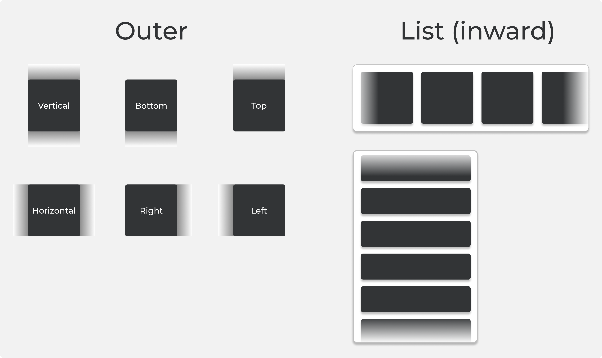

# React Native Fade Wrapper

<p align="center">
  
</p>

**`rn-fade-wrapper`** is a simple, highly-performant React Native component that adds smooth, customizable **fade gradients** to the edges of any content. Perfect for enhancing the user experience in scrollable containers, lists, carousels, modals, or any view with overflowing content.

<div align="center" style="max-width: 400px; margin: auto;">
  <a href="https://www.npmjs.com/package/rn-fade-wrapper">
    
  </a>
  
  
  
  
  <a href="https://bundlephobia.com/result?p=rn-fade-wrapper">
    
  </a>
</div>

---

## ✨ Features

- ⚡ Native rendering for **iOS** and **Android**
- 🔁 Supports **vertical** and **horizontal** gradient directions
- 🎨 Fully **customizable fade size and color** (per side or uniform)
- ↕️ Optional `inward` mode to fade **towards content** instead of outward
- 🧩 Simple API: drop-in wrapper with intuitive props
- 💪 Great performance with low overhead — ideal for scroll views and animations

---

## 📦 Installation

```bash
yarn add rn-fade-wrapper
```

or

```bash
npm install rn-fade-wrapper
```

---

## 📱 Platform Support

| Platform | Old Arch | Fabric |
|----------|----------|--------|
| iOS      | ✅        | ✅      |
| Android  | ✅        | ✅      |

---

## 🚀 Quick Start

```tsx
import { FadeWrapper } from 'rn-fade-wrapper';

const MyComponent = () => {
  return (
    <FadeWrapper
      color="#ffffff"
      size={24}
      orientation="vertical"
    >
      <ScrollView>
        <Text>Fading edges example</Text>
      </ScrollView>
    </FadeWrapper>
  );
};
```

---

## 🧩 Props

| Prop         | Type                       | Default                     | Description |
|--------------|----------------------------|----------------------|-------------|
| `color`      | `string`                   | `"#ffffff"`          | Fade color (can be any valid color string) |
| `size`       | `number`                   | `20`                 | Uniform fade size in points |
| `style`      | `ViewStyle`                | `{ zIndex: 2 }`      | Custom style applied to the wrapper view |
| `inward`     | `boolean`                  | `false`              | Makes the gradient fade inward (towards the center) instead of outward |
| `sizes`      | `{ top?: number, right?: number, bottom?: number, left?: number }` | `undefined` | Specific fade sizes per edge (overrides `size` and `orientation`) |
| `orientation`| `'horizontal' \| 'vertical'` | `'vertical'`       | Preset for direction: applies `size` to top/bottom or left/right |
| `children`   | `React.ReactNode`          | —                    | Your wrapped content |

> **Note:** `sizes` takes precedence over both `size` and `orientation`.

---

## 🎛 Examples

### 🎯 Custom sides + inward fade:
```tsx
<FadeWrapper
  color="black"
  inward
  sizes={{ top: 20, bottom: 30 }}
>
  <FlatList ... />
</FadeWrapper>
```

### 📜 Horizontal scroll fade:
```tsx
<FadeWrapper
  color="rgba(0,0,0,0.5)"
  size={16}
  orientation="horizontal"
>
  <ScrollView horizontal>
    {/* content */}
  </ScrollView>
</FadeWrapper>
```

---

## 🛠 Under the Hood

- **iOS:** Uses `CAGradientLayer` inside native `UIView`
- **Android:** Draws `LinearGradient` on custom `ViewGroup` using Canvas
- Handles layout and re-renders with platform-specific logic for consistency

---

## 💡 UX Tip

Use `rn-fade-wrapper` to subtly indicate content overflow — especially in carousels, scroll views, and horizontal sliders. Gradients help hint to the user that there's more to scroll, improving engagement.

---

## 📘 License

MIT — free to use, improve and contribute 🎉

